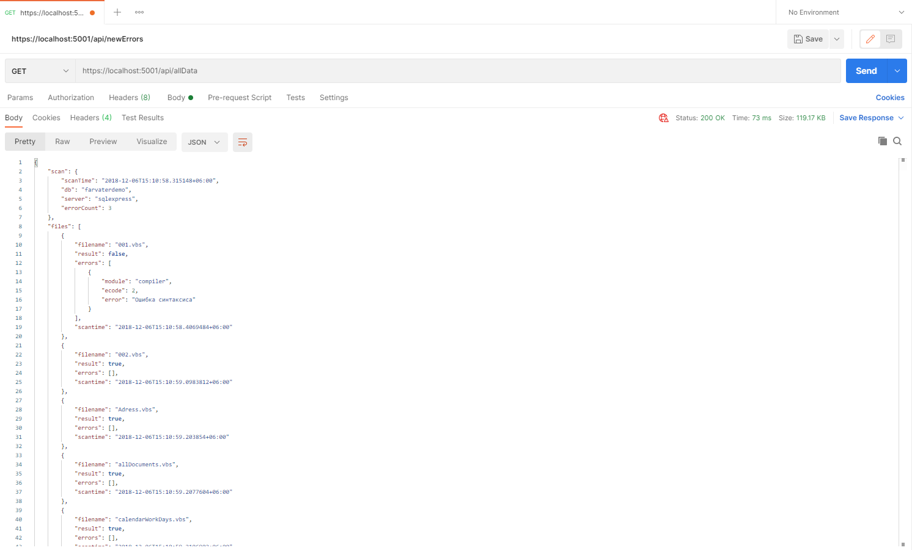
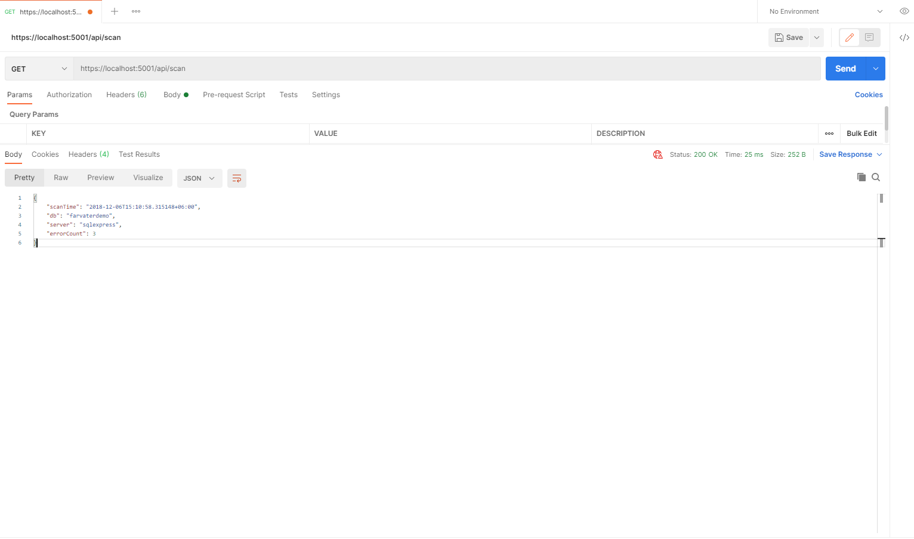

# ASP.NET SIMPLE WEB API
Простой WEB API сервер на ASP.NET для тестовго задания "МАГМА-КОМПЬЮТЕР"

## GET "api/allData"
Выдать все данные, прочитанные из файла data.json, в неизменённом виде.

## GET "api/scan"
Выдаёт данные из свойства scan. scanTime, db, server, errorCount.

## GET "api/filenames?correct={value}"
Выдать все свойства filename массива result.files, у которых свойство result = value.
{value} должно принимать значения true или false.

## GET "api/errors"
Выдать массив DTO-объектов, содержащих имена всех файлов, у которых при сканировании обнаружились ошибки (result = false), а также описание этих ошибок (свойство errors.error). Следует учесть, что errors – это массив, и ошибок при проверке файла может быть больше, чем одна.

## GET "api/errors/count"
Выдать простой integer: количество ошибок (scan.errorCount).

## GET "api/errors/{index}"
Выдать DTO-объект, содержащий имя файла, у которого при сканировании обнаружились ошибки (result = false), а также описание этих ошибок (свойство errors.error) по заданному индексу.

Параметр {index} – порядковый номер файла (filename) с ошибкой (если, к примеру, scan.errorCount = 3, index будет от 0 до 2).

Следует учесть, что errors – это массив, и ошибок при проверке одного файла может быть больше, чем одна

## GET "api/query/check"
Выдаёт DTO-объект, который содержит результат проверки файлов, у которых свойство filename начинается с «query_» (независимо от регистра).

Первое свойство: total (integer) – суммарное количество файлов, начинающихся на “query_”.

Второе: correct (integer) - суммарное кол-во файлов, у которых свойство result = true (без ошибок).

Третье: errors (integer) - суммарное кол-во файлов, у которых свойство result = false (с ошибками).

Четвёртое свойство добавляется, если свойство errors больше нуля.

Это свойство filenames (массив string) - имена файлов (filename), в которых были найдены ошибки. В остальных случаях в четвёртом свойстве может передаваться null\пустой массив.

## POST "api/newErrors"
Команда для сохранения новых результатов проверок на сервере.

Принимает текст в формате json - проверяет, что текст действительно десериализуется в корректный объект со свойством Scan и массивом Files, затем сохраняет полученный JSON в папку программы под именем ДД-ММ-ГГГГ_ЧЧ-ММ-СС.json, где ДД-ММ-ГГГГ_ЧЧ-ММ-СС – текущая дата. При каких-либо ошибках парсинга\невозможности записать файл сервером возвращаются соответствующие ошибки.

## GET "api/service/serviceInfo"
